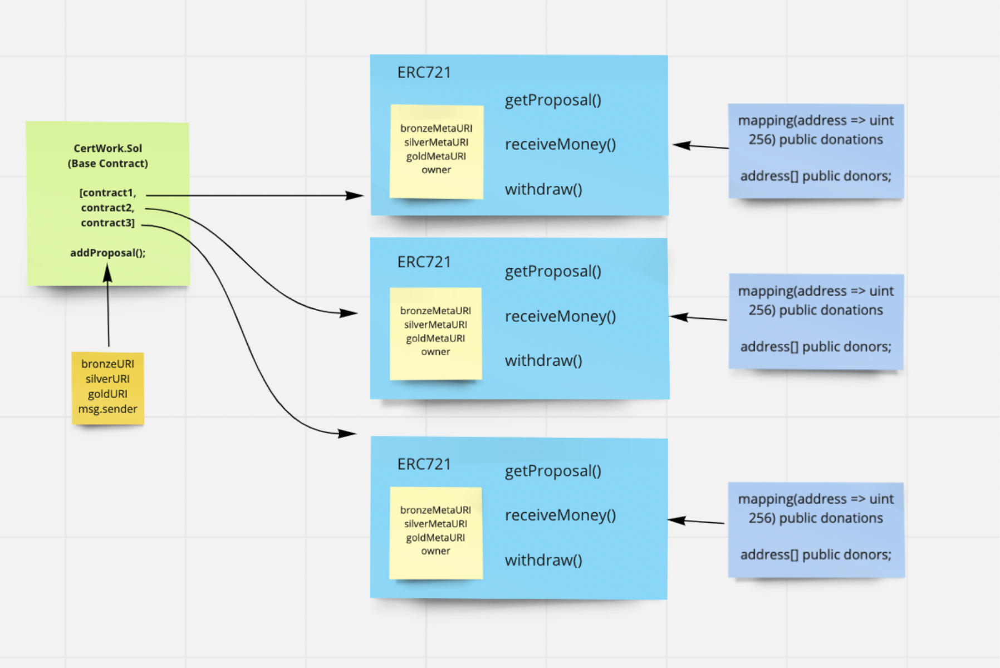

# cert-work-beta

<CERT> (Community-Engaged Research Token)

**Web3 application for funding research proposals on the ethereum blockchain**
- handles creation of proposals by researchers who are seeking crypto funding
- allows proposal owners to seek different tiered funding amounts per proposal
- allows offering of tiered rewards via a minted NFT (based on amount donated)
- allows general public to contribute to studies and be rewarded accordingly

To run local development instance of application:
- `npm install`
- `npm start`\
View at `localhost:3000`
